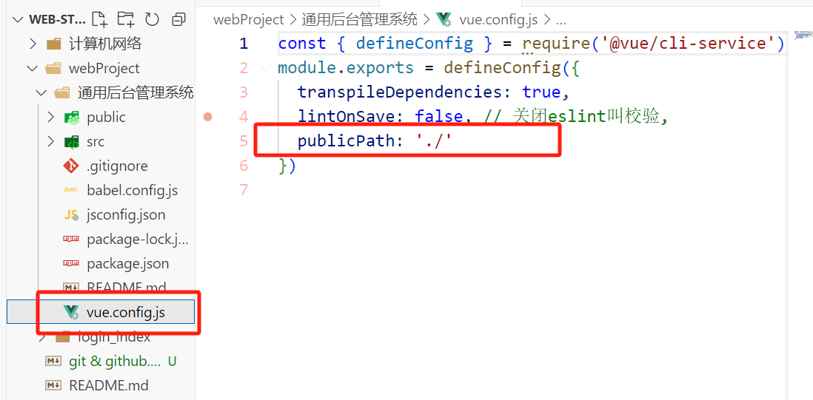
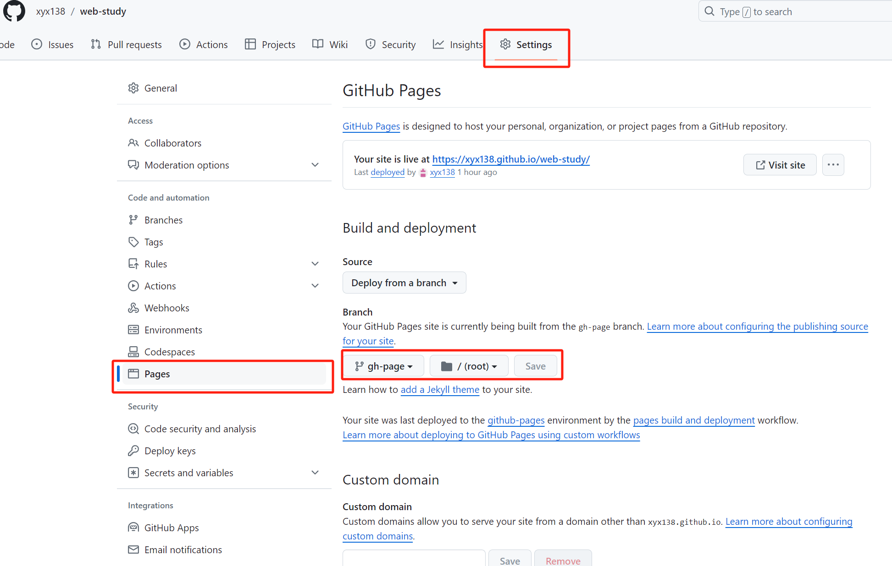

# 1. 报错：fatal: unable to access 'https://github.com/.../.git': Could not resolve host: github.com

## 解决方案：
    git config --global http.proxy 127.0.0.1:7890
    git config --global https.proxy 127.0.0.1:7890

原文地址：https://blog.csdn.net/qq_38415505/article/details/83687207    

# 2. 如何在github上部署vue项目

1. 修改publicPath的配置  
    

2. 打包vue项目，生成dist文件夹  
   **注意**：打包操作要在项目目录下进行
      

    

3. 将dist文件夹的内容推送到远程仓库
   > 这里推送到了远程仓库的gh-page分支，不要包括dist文件夹，**最外面要有index.html**，否则部署失败
   

4. 配置page项  
   

5. 完成部署
    

